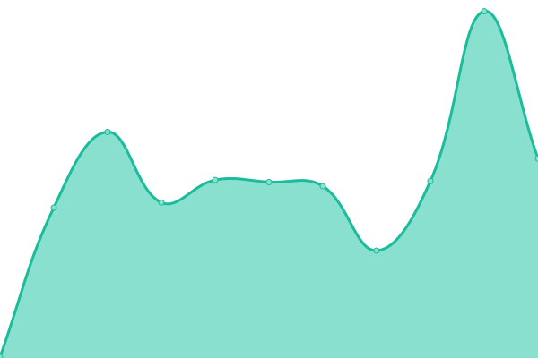

# [📈 Live Status](https://status.evantahler.com): <!--live status--> **🟩 All systems operational**

This repository contains the open-source uptime monitor and status page for [Evan Tahler](www.evantahler.com), powered by [Upptime](https://github.com/upptime/upptime).

With [Upptime](https://upptime.js.org), you can get your own unlimited and free uptime monitor and status page, powered entirely by a GitHub repository. We use [Issues](https://github.com/evantahler/upptime/issues) as incident reports, [Actions](https://github.com/evantahler/upptime/actions) as uptime monitors, and [Pages](https://status.evantahler.com) for the status page.

<!--start: status pages-->
<!-- This summary is generated by Upptime (https://github.com/upptime/upptime) -->
<!-- Do not edit this manually, your changes will be overwritten -->
<!-- prettier-ignore -->
| URL | Status | History | Response Time | Uptime |
| --- | ------ | ------- | ------------- | ------ |
|  [www.evantahler.com](https://www.evantahler.com) | 🟩 Up | [www-evantahler-com.yml](https://github.com/evantahler/upptime/commits/HEAD/history/www-evantahler-com.yml) | 

 148ms
     
 | 

<a href="https://status.evantahler.com/history/www-evantahler-com">100.00%</a>
    

|  [blog.evantahler.com](https://blog.evantahler.com) | 🟩 Up | [blog-evantahler-com.yml](https://github.com/evantahler/upptime/commits/HEAD/history/blog-evantahler-com.yml) | 

 139ms
     
 | 

<a href="https://status.evantahler.com/history/blog-evantahler-com">100.00%</a>
    

|  [www.delicioushat.com](https://www.delicioushat.com) | 🟩 Up | [www-delicioushat-com.yml](https://github.com/evantahler/upptime/commits/HEAD/history/www-delicioushat-com.yml) | 

 131ms
     
 | 

<a href="https://status.evantahler.com/history/www-delicioushat-com">100.00%</a>
    

|  [www.actionherojs.com](https://www.actionherojs.com) | 🟩 Up | [www-actionherojs-com.yml](https://github.com/evantahler/upptime/commits/HEAD/history/www-actionherojs-com.yml) | 

 112ms
     
 | 

<a href="https://status.evantahler.com/history/www-actionherojs-com">100.00%</a>
    

|  [react.actionherojs.com](https://react.actionherojs.com) | 🟩 Up | [react-actionherojs-com.yml](https://github.com/evantahler/upptime/commits/HEAD/history/react-actionherojs-com.yml) | 

 108ms
     
 | 

<a href="https://status.evantahler.com/history/react-actionherojs-com">100.00%</a>
    

|  [docs.actionherojs.com](https://docs.actionherojs.com) | 🟩 Up | [docs-actionherojs-com.yml](https://github.com/evantahler/upptime/commits/HEAD/history/docs-actionherojs-com.yml) | 

 100ms
     
 | 

<a href="https://status.evantahler.com/history/docs-actionherojs-com">100.00%</a>
    

|  [demo.actionherojs.com](https://demo.actionherojs.com/api/status) | 🟩 Up | [demo-actionherojs-com.yml](https://github.com/evantahler/upptime/commits/HEAD/history/demo-actionherojs-com.yml) | 

 137ms
     
 | 

<a href="https://status.evantahler.com/history/demo-actionherojs-com">100.00%</a>
    

|  [chat.actionherojs.com](https://chat.actionherojs.com/api/1/status) | 🟩 Up | [chat-actionherojs-com.yml](https://github.com/evantahler/upptime/commits/HEAD/history/chat-actionherojs-com.yml) | 

 140ms
     
 | 

<a href="https://status.evantahler.com/history/chat-actionherojs-com">100.00%</a>
    

|  [www.voom.flights](https://www.voom.flights) | 🟩 Up | [www-voom-flights.yml](https://github.com/evantahler/upptime/commits/HEAD/history/www-voom-flights.yml) | 

 294ms
     
 | 

<a href="https://status.evantahler.com/history/www-voom-flights">100.00%</a>
    

<!--end: status pages-->

[**Visit our status website →**](https://status.evantahler.com)

## 📄 License

- Powered by: [Upptime](https://github.com/upptime/upptime)
- Code: [MIT](./LICENSE) © [Evan Tahler](www.evantahler.com)
- Data in the `./history` directory: [Open Database License](https://opendatacommons.org/licenses/odbl/1-0/)
